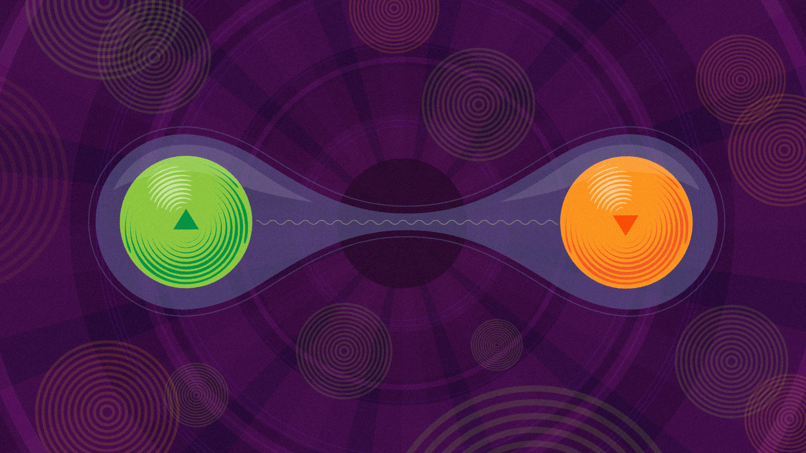
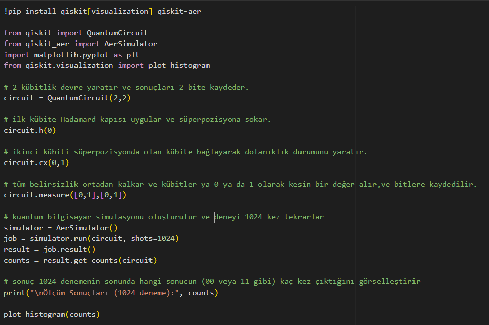
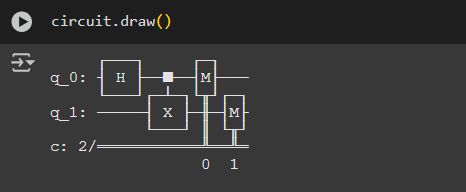
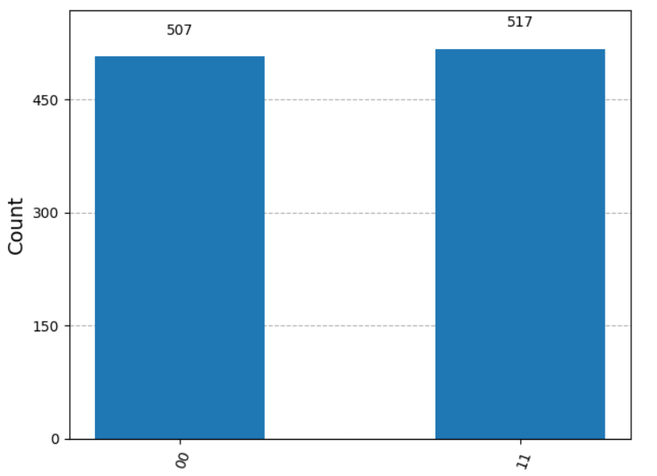

# **Einstein Haksız mıydı? Qiskit ile İlk Kuantum Deneyimi**

`    `Fizik yasaları evrenin iki ayrı ucundaki iki parçacığın kaderini anında bir birine bağlayabilirmi? Albert Einstein bu fikre “ürkütücü uzaktan etki” diyerek şiddetle karşı çıkmıştı.Mantığımza tamamen aykırı olan bu iddia, modern fiziğin en derin gizemlerinden biridir.

Acaba bu “ürkütücü etki” sadece bir matematiksel soyutlama mıydı, yoksa gerçekten de kodla test edip kanıtlayabileceğimiz bir gerçek mi?

Bu yazıda hiçbir özel donanıma ihtiyaç duymadan, sadece bir web tarayıcısı ve IBM’in açık kaynaklı Qiskit kütüphanesini kullanarak bu teoriyi kodlarla kanıtlamaya çalışacağız.
## **Bölüm 1: Hedefimiz ne? Bell Durumu ve “Anlaşma”**
Hedefimiz: Dolanıklığın en temel durumu olan bir **Bell Durumu** yaratmak.

Bir **Dolanıklık durumu** yaratdığımızda her bir kübit her zaman diğer kübitin değerini belirler.Klasik bilgisayarların çalışma prensibinde bitler bir durumda ya 0 ya da 1 olur.Ancak kuantum bilgisayarlarda kübitler aynı anda hem 0 hemde 1 olma olasılığını eşit düzeye getirir ve bu sayede hesaplamalar klasik bilgisayarlara göre çok daha hızlıdır.

Bir Bell durumunu, aralarında özel bir anlaşma yapmış iki kübit(klasik bilgisayarlardaki bit’e benzetebilirsiniz) gibi  düşünülebiliriz.

Bizim test edeceğimiz anlaşmanın (|Φ⁺⟩ durumu) kuralı çok basittir:
### **“ Ölçüldüğümüzde sonuçlarımız her zaman aynı olacak.”**
Yani, teorik olarak deneyin sonunda görmemiz gereken tek şey 0-0 ve 1-1 sonuçları olmalıydı. 0-1 veya 1-0 gibi zıt sonuçlar "yasak"tı.

# **Bölüm 2:Proje Zamanı! Kuantum Devresini Kurmak**
Burada amaç, yukarıdaki kuralı uygulayan bir kuantum devresi kurmak. Qiskit ile sadece bu bir kaç satırlık kod demek.
### Devrenin mantığı iki temel kuantum kapısına dayanıyor:
1. **Hadamard Kapısı** (H): ilk kübiti 0 ve ya 1 olmaktan çıkarıp, her ikisinin de aynı olasılıklarını taşıyan bir **süperpozisyon** durumuna sokar. Bu, belirsizliği yaratan adımdır
1. **CNOT Kapısı** (CX): İlk kübitin bu belirsiz durumunu kullanarak ikinci kübitin durumunu ona bağlar.

`        `Bu aralarında o meşhur dolanıklık bağını kuran adımdır.
## **İşte bu mantığı hayata geçiren Python kodu ve devrenin şeması:**  
**Python Kodu:**

**Devre Şeması:**

# **Bölüm 3: Sonuçlar: Teori Pratikte doğrulandı**
Peki simülasyon ne sonuç verdi? İşte ham veriler:

- Ölçüm Sonuçları (1024 deneme): {'11': 517, '00': 507}

Bu rakamları bir histogram grafiğine döktüğümüzde ise tablo çok daha netleşiyor:

Bu grafik deneyin başarılı olduğunun kanıtıdır:

- **Kanıt 1 (Dolanıklık)**: 1024 denemenin hiçbirinde "yasak" olan 01 veya 10 sonuçları çıkmadı. Parçacıklar, aralarındaki anlaşmaya sadık kaldı.
- **Kanıt 2 (Süperpozisyon):** Sonuçlar neredeyse mükemmel bir %50-%50 dağılımı gösteriyor. Bu da ölçüm yapılana kadar sistemin gerçekten belirsiz bir durumda olduğunu doğruluyor

**Bölüm 4: Simülasyonun ötesi: Gerçek Donanımın “Gürültü” Dünyası**

Simülasyonumuz ideal bir dünyada mükemmel şekilde çalıştı.Peki bu devreyi gerçek bir kauntum bilgisayarda çalıştırsaydık ne olurdu?

Gerçek kuantum donanımları, ortamdaki sıcaklık dalgalanmaları, manyetik alanlar ve lazer atımlarındaki kusurlar fiziksel etkenler yüzünden **“gürültülü”** çalışır.Bu gürültü, kübitlerin hassas kuantum durumunu bozarak hatalara yol açar.

Gerçek bir cihazda çalıştırmamış olsak da, tipik bir sonuç aşağıdaki gibi olurdu. Aşağıdaki grafik, benim ideal simülasyon sonucum ile gerçek bir kuantum cihazından alabileceğimiz örnek bir sonucu karşılaştırıyor:

 

Bu karşılaştırma günümüz kuantum bilişiminin en büyük mücadelesini gözler önüne seriyor **- Kuantum Hata Düzeltme (Quantum Error Correction).** Bilim insanlarının ve mühendislerin en büyük hedefi  bu "gürültüyü" en aza indirerek gerçek donanımları simülasyonların teorik mükemmelliğine yaklaştırmaktır.
# **Kapanış: Bir Sonraki Adım Ne?**
Bu basit proje, benim için kuantum dünyasının kapısını araladı ve en karmaşık görünen konuların bile pratik deneylerle anlaşılabileceğini gösterdi. Kuantum bilişimin hala ilk günlerinde olması, aslında bizler için büyük bir fırsat. 

Keşfedilecek çok şey var!

herkesin bu heyecan verici alana ilk adımı atabileceğini göstermek istedim.kendi deneylerinizi yapabilir ve sonuçlarınızı paylaşabilirsiniz.

Okuduğunuz için teşekkürler!

